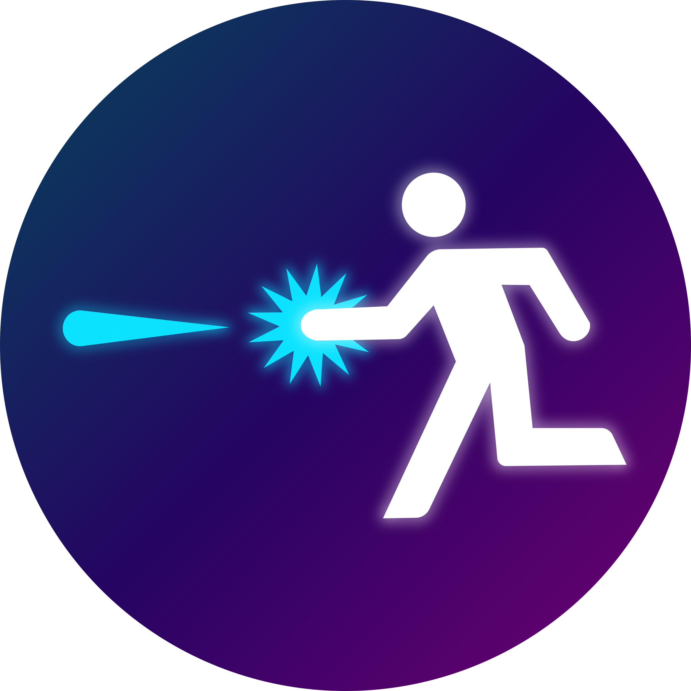

 
     

 

<h3 align="center"><b>
Check out my projects below (*^_^*)
</b></h3>

## Flutter
#### ⏲ [Pomodoro Timer](https://desolaterobot.github.io/pomodoro/#/)
#### 💸 [Subscription Tracker App](https://play.google.com/store/apps/details?id=com.desolate.substracker)

## Unity
#### 🕹 [Eternal Grid: a Top-down Endless Shooter](http://desolaterobot.itch.io/eternal-grid)

## Python
#### 🔐 [ThothCrypt: file encryption tool](https://github.com/desolaterobot/thoth)
#### 📝 [scarab: text-based encrypted notetaking](https://github.com/desolaterobot/scarab)

## C
#### 📁 [blkr: file renaming tool](https://github.com/desolaterobot/blkr)
